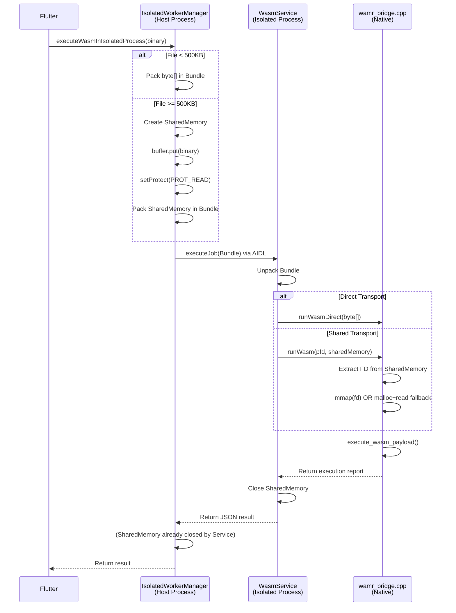

# Kotlin Architecture Deep Dive

## Overview
This document explains the Kotlin layer responsible for orchestrating WASM execution via an isolated service process.

---

## File Structure

```
android/app/src/main/kotlin/com/example/consumer/features/
├── orchestrator/
│   └── IsolatedWorkerManager.kt   (Host Process - Orchestrator)
└── execution/
    ├── WasmService.kt             (Isolated Process - Worker)
    └── WasmJNI.kt                 (JNI Bridge to C++)
```

---

## 1. IsolatedWorkerManager.kt (The Orchestrator)

**Location**: Host Process (Main App)
**Role**: Transport Decision Maker & IPC Coordinator

### Responsibilities
1. **Service Binding**: Connects to the isolated `WasmService` via AIDL
2. **Transport Selection**: Chooses between Direct (Binder) or Shared (Memory) based on file size
3. **Data Packaging**: Prepares the Bundle for cross-process transfer
4. **Lifecycle Management**: Manages service connection retries and cleanup

### Key Methods

#### `executeWasmInIsolatedProcess(binary: ByteArray, memoryLimitMB: Int)`
Main entry point called by Flutter layer.

**Flow**:
```
1. Check if service is bound → If not, bind (with retries)
2. Analyze file size
3. IF size < 500KB:
     → Strategy: Direct Transport
     → Action: Put binary in Bundle as byte[]
   ELSE IF API ≥ 27:
     → Strategy: SharedMemory
     → Action: 
       a. Create SharedMemory.create("wasm_ipc", binary.size)
       b. Map for Read/Write
       c. buffer.put(binary)
       d. Unmap buffer
       e. Set PROT_READ (seal)
       f. Put SharedMemory in Bundle
   ELSE:
     → Strategy: Temp File (Legacy API < 27)
     → Action: Write to cache, create ParcelFileDescriptor
4. Pack Bundle with: file_size, config, payload (blob | shared_memory | pfd)
5. Call wasmWorker.executeJob(args) via AIDL
6. Return result String
```

### Current Issue (SharedMemory)
**Line 109-114**: SharedMemory creation and mapping
```kotlin
val buffer: ByteBuffer = sharedMemory!!.mapReadWrite()
buffer.put(binary)
SharedMemory.unmap(buffer)
sharedMemory!!.setProtect(android.system.OsConstants.PROT_READ)
```

**Hypothesis**: The buffer write might not be flushing correctly, or the setProtect is happening before the write completes.

---

## 2. WasmService.kt (The Worker)

**Location**: Isolated Process (`:wasm_worker`)
**Role**: Execution Sandbox

### Configuration (AndroidManifest.xml)
```xml
<service
    android:name=".features.execution.WasmService"
    android:isolatedProcess="true"
    android:process=":wasm_worker">
    <intent-filter>
        <action android:name="com.example.consumer.WASM_WORKER" />
    </intent-filter>
</service>
```

### Responsibilities
1. **Resource Isolation**: Runs with restricted UID (no permissions)
2. **Bundle Unpacking**: Extracts payload from Bundle
3. **JNI Invocation**: Calls appropriate WasmJNI method
4. **Result Serialization**: Wraps result in JSON

### Key Methods

#### `executeJob(args: Bundle): String`
AIDL interface implementation.

**Flow**:
```
1. Unpack Bundle:
   - file_size: Long
   - config: String (JSON)
   - pfd: ParcelFileDescriptor? (for temp file)
   - shared_memory: SharedMemory? (for large files)
   - blob: ByteArray? (for small files)

2. Parse config JSON → memoryLimitMB

3. Route to JNI:
   IF blob != null:
     → WasmJNI.runWasmDirect(blob, fileSize, memLimit)
   ELSE:
     → WasmJNI.runWasm(pfd, sharedMemory, fileSize, memLimit)

4. Wrap result:
   {
     "status": "SUCCESS",
     "output": "<execution_report>",
     "pid": <process_id>
   }

5. Finally: Close pfd and sharedMemory
```

**Critical Note**: Line 65 closes SharedMemory in the `finally` block. This is the **second close** (first one is in IsolatedWorkerManager).

---

## 3. WasmJNI.kt (The Bridge)

**Role**: Kotlin ↔ C++ Interface

### JNI Methods

#### `runWasm(pfd, sharedMemory, fileSize, memLimit)`
Handles Shared Memory or File Descriptor transport.

**Native Signature**:
```cpp
JNIEXPORT jstring JNICALL
Java_..._runWasm(JNIEnv *env, jobject, 
                 jobject pfd, 
                 jobject shared_mem,
                 jlong file_size, 
                 jint memory_limit_mb)
```

#### `runWasmDirect(binary, fileSize, memLimit)`
Handles Direct byte[] transport.

**Native Signature**:
```cpp
JNIEXPORT jstring JNICALL
Java_..._runWasmDirect(JNIEnv *env, jobject,
                       jbyteArray binary,
                       jlong file_size,
                       jint memory_limit_mb)
```

---

## 4. Data Flow Diagram



---

## 5. Debugging the SharedMemory Issue

### Symptoms
- Small files (Direct Transport): ✅ Works
- Large files (Shared Transport): ❌ "Magic header not detected"

### Hypothesis Chain

#### H1: Buffer Not Flushed
**Test**: Add explicit sync after `buffer.put(binary)`
**Status**: ByteBuffer.force() doesn't exist in Android API

#### H2: Premature Close
**Test**: Remove `sharedMemory?.close()` from IsolatedWorkerManager
**Status**: Applied (line 160 commented out)

#### H3: Race Condition
The SharedMemory lifetime:
```
1. Create (Manager)
2. Map & Write (Manager)  
3. Unmap (Manager)
4. setProtect (Manager)
5. Pass via Binder → Service receives reference
6. JNI gets FD (Service)
7. mmap(FD) (Native)     ← CRITICAL POINT
8. Close (Service finally) ← Might invalidate FD before step 7 completes
```

**Next Steps**:
1. Add logging to print first 4 bytes at each stage
2. Verify SharedMemory FD number in logs
3. Check if mmap errno reveals specific issue

---

## 6. Potential Fixes

### Option A: Delay Service Close
Keep SharedMemory open in Service until AFTER native execution completes.

### Option B: Duplicate FD Earlier
Use `dup()` on the SharedMemory FD immediately in JNI to prevent invalidation.

### Option C: Revert to Fallback Only
Force all large files to use malloc+read fallback, bypassing mmap entirely.
