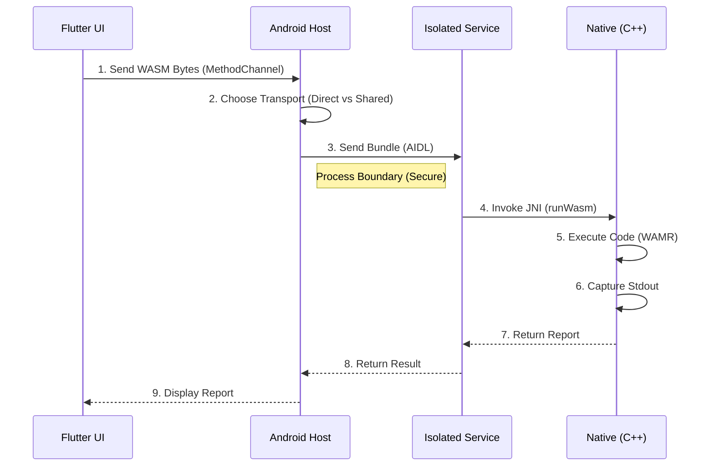

# System Overview: secure-wasm-consumer

## 1. Introduction
This application is a proof-of-concept for running untrusted WebAssembly (WASM) code securely on Android devices. It treats WASM binaries as "compute payloads" that are executed in a strictly isolated environment, ensuring the safety of the host application.

## 2. User Journey
1.  **Selection**: The user opens the app and selects a `.wasm` file using the system file picker.
2.  **Execution**: The user taps "Run". Access to the file is granted to the execution engine.
3.  **Result**: The app displays a detailed execution report, including:
    *   Success/Failure Status.
    *   Return Value (e.g., `42`).
    *   Standard Output (e.g., `Hello World`).
    *   Memory Usage & Transport Strategy used.

## 3. Component Architecture

The app is built in layers, moving from high-level UI to low-level Kernel operations.

### Layer 1: The UI (Flutter)
*   **Role**: Visual interface.
*   **Key File**: `lib/main.dart`
*   **Function**:
    *   Uses `file_picker` to get a content URI.
    *   Reads the file bytes into memory.
    *   Sends the binary payload to the Android host via `MethodChannel` (`com.example.consumer/wasm`).

### Layer 2: The Orchestrator (Android/Kotlin)
*   **Role**: Process Management & Transport Decision.
*   **Key File**: `IsolatedWorkerManager.kt`
*   **Function**:
    *   Receives the binary from Flutter.
    *   **Decision Engine**:
        *   If file < 500KB: Packs it as a `byte[]` (Direct Transport).
        *   If file > 500KB: Creates `SharedMemory`, maps it, and passes the File Descriptor (Shared Transport).
    *   Binds to the Isolated Service (`WasmService`).
    *   Sends the payload via AIDL (IPC).

### Layer 3: The Isolated Service (Android/Kotlin)
*   **Role**: Security Boundary.
*   **Key File**: `WasmService.kt`
*   **Configuration**: `android:isolatedProcess="true"`
    *   This process runs with a restricted UID. It has **no permissions** (no network, no storage access).
    *   If this process is compromised by malicious WASM, it cannot harm the User or the App.
*   **Function**:
    *   Unpacks the bundle (Bundle -> `byte[]` or `SharedMemory`).
    *   Calls the Native Bridge (JNI).

### Layer 4: The Native Engine (C++/NDK)
*   **Role**: Execution.
*   **Key File**: `wamr_bridge.cpp`
*   **Technology**: WebAssembly Micro Runtime (WAMR).
*   **Function**:
    *   **Loading**: Parses the WASM header.
    *   **Instantiation**: Allocates Stack/Heap (restricted by `memoryLimitMB`).
    *   **Output Capture**: Redirects `stdout` to a pipe to capture logs.
    *   **Execution**: Runs the `main` function.
    *   **Reporting**: Returns a structured string back up the chain.

## 4. Data Flow Diagram

## 5. Security Features
*   **Process Isolation**: The execution happens in a disposable sandbox process.
*   **Memory limits**: Native heap is capped; `setrlimit` prevents CPU hogging.
*   **Crash Safety**: If WASM crashes (segfault), only the Isolated Service dies. The Main App (UI) remains alive and reports the error.
